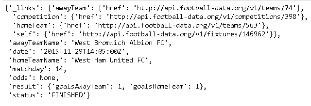
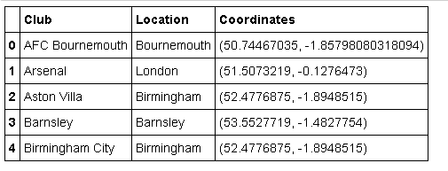
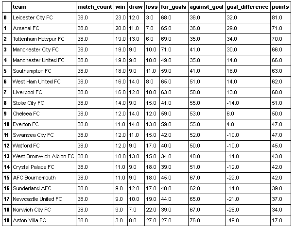
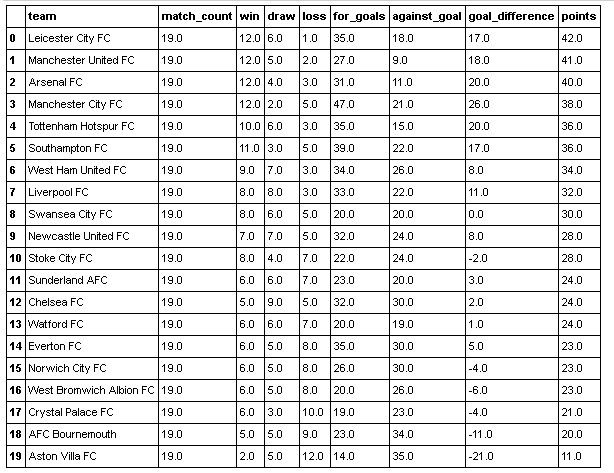
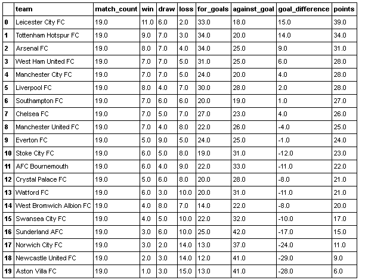
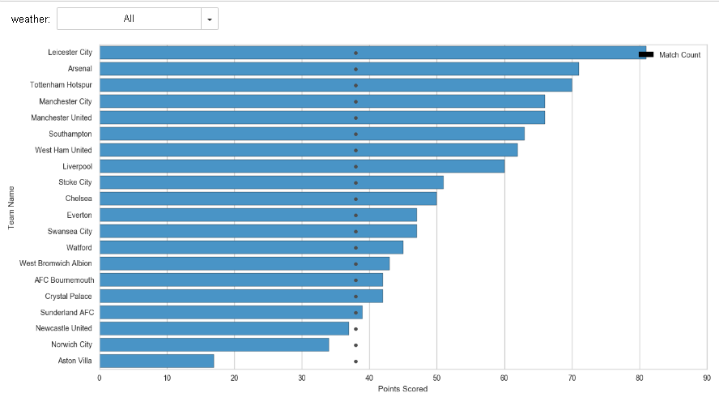
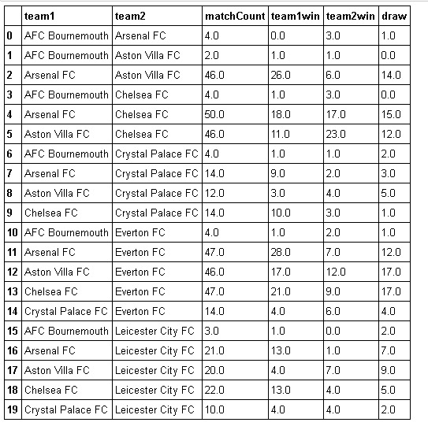
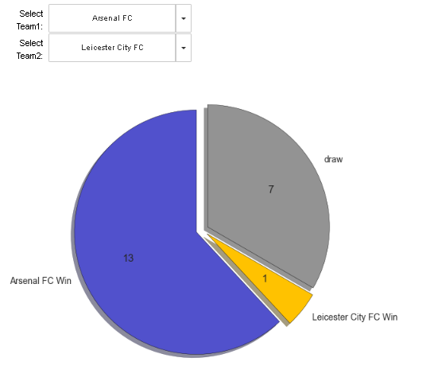
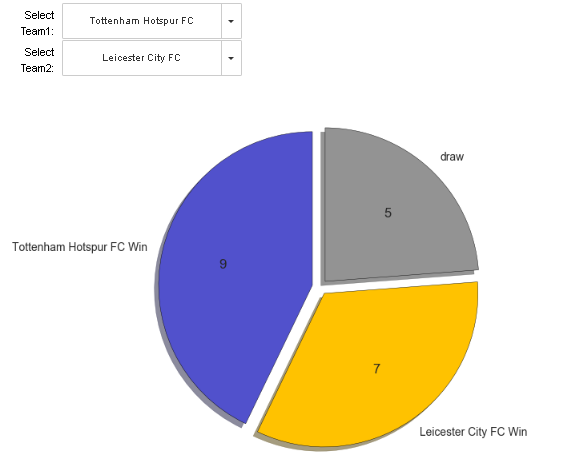
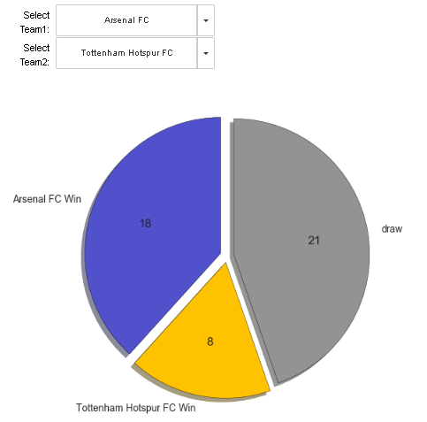

# INFO7374 37370 ST:Data Analysis Using Python Spring 2017- Final Project


##  DATA ANALYSIS ON PREMIER LEAGUE 2015


#### The project focuses on Premier League matches heald on 2015. The data from Football API is joined with the weather API to fetch weather details on the match day. In order to fetch weather API, location, date,coordinates are required. Match location details are webscraped from Wikipedia 
### Data Source:
#### * Football API:
##### API Link: [http://api.football-data.org/index](http://api.football-data.org/index)
Foot ball API have many sub API's,
##### - Competition API:
* This API was used to identify the competion id for Premier League 2015. [CompotetionList_json](Data/Football/competition_list)
* Identified competion ID and stored in a global variablle
##### - Fixture Matches API:    
* Based on above competion ID all match details are fetched as one JSON data. 
* The JSON data is indexed, sliced and stored as 1 JSON file per match
* file is stored in the following format: "HomeTeam"+"vs"+"AwayTeam+format+ "on"+ "Match Day" 
##### - Fixture head2head API:
* Matches between 2 teams at a particular place is given a fixture ID. All historical matches between these two teams is stored under that fixtureID
* This API is is used to fetch historical match details based on fixture ID.
* From the match specific JSON files that was fetched using previous API, Fixture IDs between two unique teams is fetched
* These fixture ID id used to fetch 50 historical matchs data between those two team.

#### * Wikipedia:
##### Link: [https://en.wikipedia.org/wiki/List_of_Premier_League_stadiums](https://en.wikipedia.org/wiki/List_of_Premier_League_stadiums)
Performed web scrape using python to fetch matches home location for every team    

#### * Weather API:
##### API Link: [https://developer.worldweatheronline.com/](https://developer.worldweatheronline.com/)
* Installed geopy to find coordinates for locations
* Based on match date, match held location and its geo coordinates, all ther required weather data is fetched and stored as json fields in following format "Location_Date"

     
    
    
        


### Collection and Processing:
* Competion ID from Football competion API is used to read match details for Premier League 2015. 
* Sample match JSON file:



* Files are stored based on hometeam name as this will also represent the match location

* Required data includes, date, homeTeamName, awayTeamName,results(homeTeamGoal,awayTeamGoal)


* In order to acces the weather data, match date and location is required. Match locations are fetched by webscraping wikipedia. A CSV file is generated containing team name and its location. As every match contains home team and away team names, merging on team names with the webscrape csv file will give us the match location  

* Python geopy is used to fetch coordinates of the city



* These details are merged with the initial matches DF


* Weather API is called using date lat,long and location. The Data retrieved is stored based on match location.


* In order to fetch match history between any two teams, we need fixture id. This data is available in individual matches that was pulled for premier league. When Chelsea is the home team and ManU is the away team, their fixture ID is different when companed with matches where ManU is home team and Chealse is away tem. But the match history details are the same. So we will consider only unique combination of any two teams. 
* Fixtures between any two unique team combination is store as JSON Files.

### Analysis Performed
Let us start by analyse every team's performance in Premier League 2015
### Analysis 1:
- Build a league Table containing points details of all teams who played in Premier League
- Analyze all team's performance in both home and away matches
#### STEPS:
* Three empty dataframes are created(match_details_dataframe,home_match_dataframe,away_match_dataframe). All these dataframes will contain team name, number of matches played, number of won, number lost ,number of draw,total number team goals,total number of oponent team goals
* All JSON files for every match is read one by one.
* Once a JSON file is loaded, Check if home team name is already available in dataframe. 
    * If yes then that recorder is retrieved and their  match count is incremented  by one. 
    * if home team goal is higher than away team goal then value in win column is incremented by 1. else if home team goal is equal to away team goal, then value in draw is incremented by one. else home team goal is lesser than away team goal, then value of loss is incremented by one. 
    * For goals and opponent goal values are incremented based on the values mentioned in the file.
* Similar updates are made for away team. 
* Two new columns "Goal Difference" and "points" are included in the dataframe. 
* Goal Diifference = For Goals - Away Goals
* Points = (number of matches won * 3) + (number of matches draw * 1) + (number of matches lost * 0)
* League table is sorted based on points, goal difference, for goals. If there are two teams with same rank in ythe league table even after considering all these three criteria, according to match rules, these two teams will play again. 
##### OVERALL LEAGUE TABLE

    * Similarly Home matches league Table and Away matches league table is crested
##### HOME LEAGUE TABLE    

##### AWAY LEAGUE TABLE

#### Analysis:

Top three teams in Premier League 2015 are,

Rank|Team|points
----|----|-----
1|Leicester City FC|81
2|Arsenal FC |71
3|Tottenham Hotspur FC|70

Let us find out for these teams reamin in top 3 position in home and away league table,

HOME LEAGUE TABLE                                     

Rank|Team|points                                      
----|----|-----
1|Leicester City FC|42
2|Manchester United FC |41
3|Arsenal FC|40

AWAY LEAGUE TABLE

Rank|Team|points                                      
----|----|-----
1|Leicester City FC|39
2|Tottenham Hotspur FC |34
3|Arsenal FC|31

* Although Arsenal FC is in second place in over all points table, they are third place in both home league table and away league table. 
* All teams in general have scored higher points in home ground games compared to away games. 
 
### Analysis 2:
- Identify if weather affects a team's performance
#### STEPS:
    * For this analysis the consolidated dataframe with every match details, weather and location details is considered

* Unique list of weather conditions are identified. I noticed that there were few redundant entries like 'Light rain shower' and 'Light rain'. All such entries have been combined into a single weather type 
* After combining, We have 12 weather types, 'Cloudy', 'Sunny', 'Light rain shower', 'Heavy rain shower',
   'Moderate rain shower', 'Light drizzle', 'Light snow showers',
   'Heavy rain', 'Thundery outbreaks possible', 'Light sleet showers',
   'Light snow', 'Heavy snow showers'
* ipywidgets is used to create dropdown box containing all these weather types
* once a weather type is selected, a copy of original dataframe is obtained and the dataframe is filtered to contain matches for the selected weather type
* Based on this filtered dataframe, a new dataframe (df_team_match_details) containing match count, number of matches won, number of matches lost, number of matches drawn, for-goals, away-goals, points scored is created. 
* A barh plot is created with total points in x-axis and team names in y-axis
    
* Black dots represents the total number of matches played
#### Analysis:
- Let us analyse how teams play in worst weather conditions(Heavy rain and snow)
HEAVY RAIN AND HEAVY SNOW SHOWERS

  
  
- We can see than from heavy rain condition, watford has not performed well(Lost all their 3 matches under heavy rain).
- On the other hand Manchester United have played consistently under all weather conditions
### Analysis 3:
- Perform head2head performance analysis

#### STEPS:
* For this analysis, all head2head JSON files for any two teams combination is read.
* The datadet contains head2head details of last 50 matches
* Collected number of matches won,lost and draw
      
* Using ipywidgets, two dropdown boxes have been created. These boxes will contain unique list of team names. 
* When a selection is made, a copy of the data frame is created
* Based on the selection from these two boxes, the dataframe copy is searched to get the required row 
* When two teams are selected, these values can be available in either team1 column or team 2 column. Hence while searching for the required row, both column 1 and column 2 is search for team1 dropdown and team2 dropdown. For example, If Chelsea is selected in team1 dropdown, occurance of chelsea is checked in both columns
    
#### Analysis:
* Let us findout the head2head performace between the top 2 teams,
 

* In the past Arsenal Vs Lestercity matches,  Arsenal has won majority of the matches. 



* While considering  LeicesterCity FC Vs Tottenham Hotspur FC, both teams have competitive records on number of matches played between them. 



* Similarly while considering Arsenal FC Vs Tottenham Hotspur FC's Historical fixtures, Arsenal has won more number of matches than Tottenham Hotspur. But a bigger portion(21 maches) of the total matches played were drawn by the two teams. This confirms that Tottenham Hotspur has the capacity to be as competitive as Arsenal.

* In 2015 Premier league,  Lestercity has suprised fans by performing exceptionally well!

* Similarly all other team head2head performance can be viewed
   


```python

```
